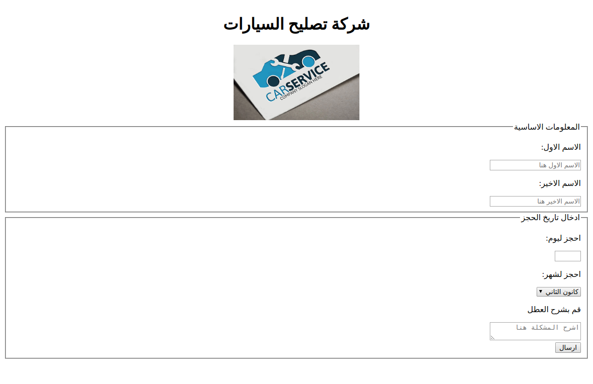

# الواجب البيتي 004

قم بتنفيذ الخطوات التالية بالتسلسل:

1. قم بخلق ملف باسم form.html
2. قم بعمل عنوان باسم "شركة تصليح السيارات" باستخدام \<h1\>
3. ادرج صورة اسفل العنوان باستخدام \ وقم باستخدام الصورة التالية:
   - https://images.examples.com/wp-content/uploads/2017/11/1-3.jpg
4. قم بعمل استمارتين الاولى لادخال الاسم الاول والاسم الاخير فقط والاستمارة الاخرى لغرض حجز موقع وكما مشروح في الاسف

   - الاستمارة الاولى تحتوي على حقلين الحقل الاول بعنوان الاسم الاول والحقل الثاني باسم اسم العائلة.

   - الاستمارة الثانية تحتوي على حقل لادخال التاريخ بشكل رقم فقط وعلى ان لا يتجاوز الرقم اكثر من 31 ولا يقل عن 1
     قم باتخدام الخصائص التالية:

   ```html
   <input ... max="31" min="1" />
   ```

   - قم بعمل حقل اخر على شكل قائمة منسدلة لادخال الشهر المراد للحجز من اجل الصيانة حيث استخدم اسماء الاشهر العربية لعرضها اما قيمها فاستخدم الاشهر باللغة الانكليزية (استخدم الانترنيت للبحث عن اسماء الاشهر بكلا اللغتين العربية والانكليزية).

   - قم بعمل حقل اخر لوصف حالة العطل عن طريق استخدام حقل متعدد السطور لغرض اعطاء شرح مفصل.
   - قم بعمل زر ارسال

5. الشكل النهائي يجب ان يكون كالصورة التالية:


