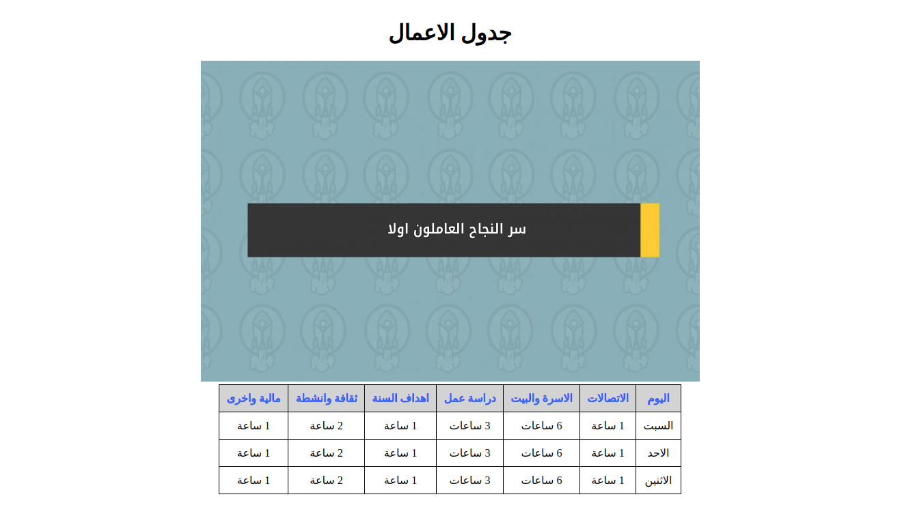

# الواجب البيتي 004

قم بتنفيذ الخطوات التالية بالتسلسل:

1. قم بخلق ملف باسم table_css.html
2. اربط ملف السي اس اس مع ملف html باستخدام وسم link
3. انشأ عنوان باسم "جدول الاعمال" وقم باستخدام h2
4. ادرج صورة اسفل العنوان باستخدام \ وقم باستخدام الصورة التالية:
   - https://www.annajah.net/resources/thumbs/article_photos/9445_annajah.jpg_730x470.jpg
5. قم بخلق جدول كما مبين في الصورة

6. قم بخلق ملف style.css وكما تعلمنا سابقاً
7. قم باعطاء خصائص السي اس اس وكما مبين في صورة الجدول.
8. كل محتويات الصفحة تكون في المنتصف.
