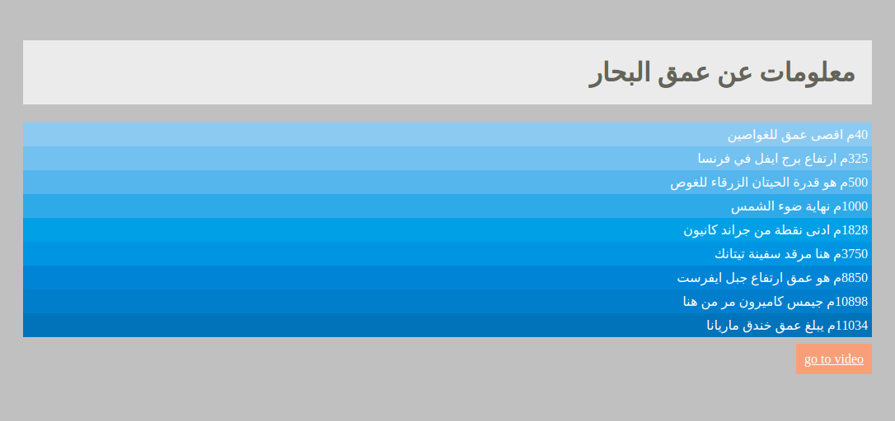

# الواجب البيتي 007

قم بتنفيذ الخطوات التالية بالتسلسل:

1. قم بعمل مشروع باسم 012
2. قم بخلف ملف سي اس اس بالامتداد التالي
   - "assets/css/style.css"
3. قم بربط ملف السي اس اس مع الاج تي ام ال وكما تعلمنا سابقاً
4. قم بادراج عمق البحار ومحتوياتها وحسب الصورة بالاسف
5. استخدم ملف السي اس اس لعمل تلوين بتدريج باستخدام دالة `rgba`

6. قم بوضع رابط للصفحة باستخدام وسم \<a\> واعطه المسمى "go to video". حيث ان رابط الفديو المطلوب وضعه هو التالي:

> https://www.youtube.com/watch?v=u4HF67YFFOA
